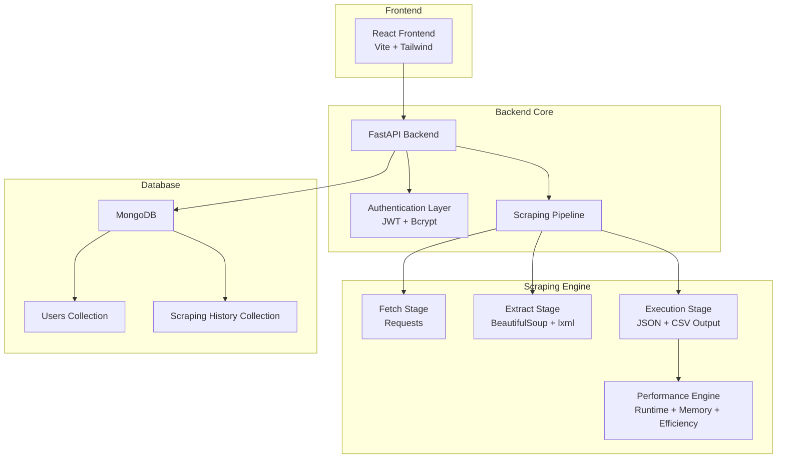
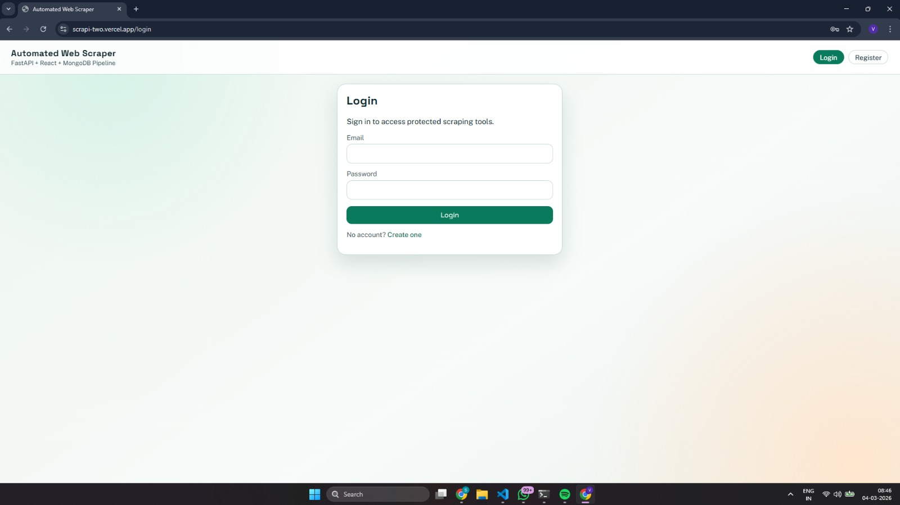
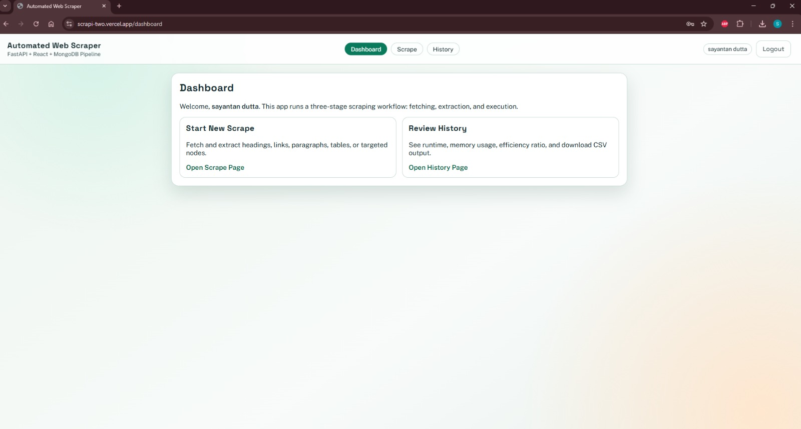
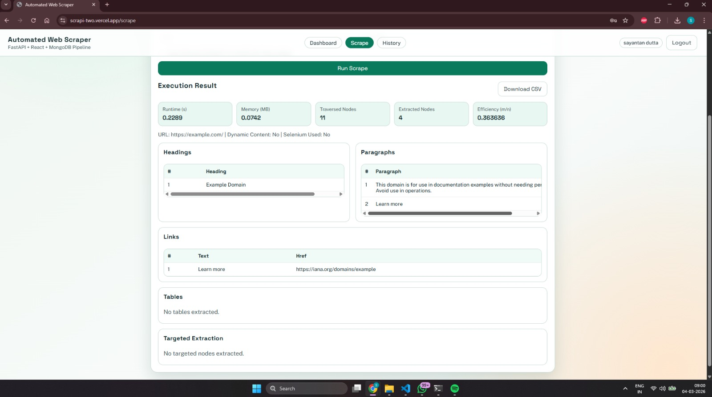

# 🚀 Automated Web Scraper
### Full-Stack Web Scraping Platform with Performance Modeling


---

Live at:
[](https://scrapi-two.vercel.app)

---

## 📌 Overview

**Automated Web Scraper** is a full-stack web application that implements a structured and measurable web scraping pipeline.

It allows authenticated users to:

- 🌐 Scrape structured data from websites  
- 📊 Measure runtime and memory usage  
- 📈 Calculate scraping efficiency  
- 📁 Export results as CSV  
- 🗂 Store scraping history in MongoDB  

The system follows a clear:

**Fetching → Extraction → Execution** architecture model.

---

# 🏗 Architecture



---

## 🧠 Architecture Explanation

### 1️⃣ Frontend Layer
- Built using **React + Vite**
- Handles:
  - Registration & Login
  - Scrape requests
  - Results display
  - History view
  - CSV download

### 2️⃣ Backend API Layer
- Built with **FastAPI**
- Handles:
  - Authentication (JWT)
  - Scrape endpoint
  - Error handling
  - Data validation

### 3️⃣ Scraping Pipeline

#### 🔹 Fetch Stage
- HTTP request using `requests`
- Custom headers
- Timeout handling
- SSL handling
- Structured error classification

#### 🔹 Extract Stage
- HTML parsing using BeautifulSoup + lxml
- Extracts:
  - Headings
  - Paragraphs
  - Links
  - Tables
- Optional targeted extraction (tag + class)

#### 🔹 Execution Stage
- Structured JSON output
- CSV generation
- Runtime measurement
- Memory tracking
- Efficiency calculation

### 4️⃣ Database Layer
- MongoDB stores:
  - Registered users
  - Scraping history
  - Performance metrics

---

## 📷 Application Screenshots

### 🔐 Authentication


### 🌐 Scrape Interface


### 📊 Results & Metrics


---

<!-- ## 🎥 Demo Video

▶ Watch Demo:  
[Click here to view working demo](assets/demo.mp4)

--- -->

<!-- # 📊 Performance Modeling

The scraper implements measurable computational modeling: -->

<!-- ### Runtime Model
T(n) = c1·n + c2·m -->

<!-- ### Memory Model
M(n) = c3·n + c4·m -->

<!-- Where:
- n = total DOM nodes traversed  
- m = extracted nodes  
- Efficiency = m / n  

--- -->

# ✨ Features

- 🔐 JWT Authentication  
- 📊 Runtime Monitoring  
- 🧠 Memory Usage Tracking  
- 📈 Efficiency Ratio Calculation  
- 📁 CSV Export  
- 🗂 Scraping History Persistence  
- ⚙ Optional Selenium Fallback  
- 🛡 Structured API Error Handling  
- 🏗 Modular Backend Architecture  

---

# 📁 Project Structure

<!-- ```
automated-web-scraper/
│
├── backend/
│   ├── app/
│   │   ├── main.py
│   │   ├── core/
│   │   ├── services/
│   │   │   ├── fetch.py
│   │   │   ├── extract.py
│   │   │   ├── execute.py
│   │   ├── routers/
│   │   ├── models/
│   │   └── database/
│   ├── requirements.txt
│   └── .env
│
├── frontend/
│   ├── src/
│   ├── components/
│   ├── pages/
│   └── package.json
│
└── README.md
``` -->

<!-- --- -->

<!-- # 🚀 Installation (Local Development)

### Clone Repository

```bash
git clone https://github.com/YOUR_USERNAME/automated-web-scraper.git
cd automated-web-scraper
```

### Backend Setup

```bash
cd backend
python -m venv venv
venv\Scripts\activate
pip install -r requirements.txt
```

Create `.env` file:

```
MONGO_URI=mongodb://localhost:27017
SECRET_KEY=your_secret_key
```

Run backend:

```bash
python -m uvicorn app.main:app --reload
```

Backend runs at:
http://127.0.0.1:8000

---

### Frontend Setup

```bash
cd frontend
npm install
npm run dev
```

Frontend runs at:
http://localhost:3000

--- -->

# 🌍 Deployment Strategy

Recommended production architecture:

| Component | Platform |
|-----------|----------|
| Frontend  | Vercel |
| Backend   | Render |
| Database  | MongoDB Atlas |

---

# 🛠 Tech Stack

- Python  
- FastAPI  
- React (Vite)  
- MongoDB  
- BeautifulSoup  
- lxml  
- JWT Authentication  

---

# 👨‍💻 Author

**Sayantan Dutta**  
 

---

# 📜 License

MIT License